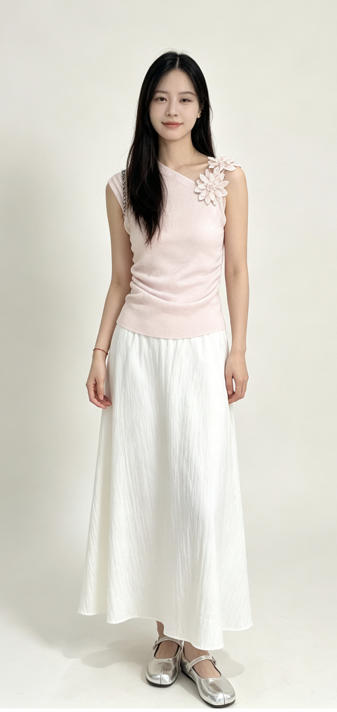

# AI Image Detector

A small, friendly open-source detector for AI-generated images. It is designed in the
`yt-dlp` / `rembg` spirit: install it, run one command, get a probability and a
reproducible report.

> AI image detection is probabilistic. Treat the output as one signal, not as proof.

## Model Choice

The default backend is **UnivFD / UniversalFakeDetect**: CLIP ViT-L/14 image
features plus a tiny linear fake/real head. This is a strong practical default
because the task-specific weight is tiny, the code path is understandable, and the
CVPR 2023 paper showed good cross-generator generalization compared with older
GAN-trained detectors.

This repo also ships **hybrid**, **nonescape-mini**, **sentry-convnext-small**,
**hybrid-plus**, and **ultra** backends. `hybrid` blends UnivFD with a
lightweight Hugging Face classifier, `nonescape-mini` and
`sentry-convnext-small` adapt external open-source detectors, `hybrid-plus`
ensembles our internal hybrid with Nonescape, and `ultra` adds Sentry on top.
This has become the strongest practical route so far without training a new
model from scratch.

The benchmark commands also support post-hoc threshold calibration objectives
such as `balanced_accuracy` and `f1`. In practice, this has been one of the most
effective low-risk levers for improving held-out performance.

Recent research has moved further. **AIDE** combines CLIP semantics with low-level
frequency/noise features and reports gains on GenImage and AIGCDetectBenchmark.
That is a good research target for a future backend, but UnivFD is currently the
simplest robust default for an installable open-source tool.

Useful references:

- UniversalFakeDetect paper: https://openaccess.thecvf.com/content/CVPR2023/html/Ojha_Towards_Universal_Fake_Image_Detectors_That_Generalize_Across_Generative_Models_CVPR_2023_paper.html
- UniversalFakeDetect code: https://github.com/WisconsinAIVision/UniversalFakeDetect
- AIDE paper: https://arxiv.org/abs/2406.19435
- GenImage benchmark: https://github.com/GenImage-Dataset/GenImage
- Tiny-GenImage runnable subset: https://huggingface.co/datasets/TheKernel01/Tiny-GenImage
- CIFAKE benchmark paper: https://huggingface.co/papers/2303.14126

## Install

Use Python 3.10+.

```bash
python -m venv .venv
source .venv/bin/activate
pip install -e .
```

Optional extras:

```bash
pip install -e '.[eval]'      # Hugging Face dataset benchmarks
pip install -e '.[hf]'        # generic Hugging Face image-classification backend
pip install -e '.[api]'       # FastAPI server
pip install -e '.[web]'       # Gradio UI
pip install -e '.[dev]'       # tests and linting
```

## CLI Usage

### Quick Start

Detect one image with the default backend:

```bash
aidetect detect image.jpg
```

Detect a folder recursively and save a CSV:

```bash
aidetect detect ./images --csv report.csv
```

Print JSON lines for scripting:

```bash
aidetect detect ./images --json
```

### Which Backend Should I Use?

- `univfd`: simplest default, smallest moving parts, good baseline.
- `sentry-convnext-small`: strong single external detector.
- `ultra`: strongest current ensemble in this repo; best first choice when you want the highest practical accuracy.
- `nonescape-mini`: useful extra signal and part of the stronger ensembles.
- `hf`: generic Transformers image-classification path for standard Hugging Face checkpoints.

If you only want one recommendation:

```bash
aidetect detect image.jpg --backend ultra
```

If you want a simpler but still strong single model:

```bash
aidetect detect image.jpg --backend sentry-convnext-small
```

Use a Hugging Face image-classification model instead of UnivFD:

```bash
aidetect detect image.jpg --backend hf --hf-model capcheck/ai-image-detection
```

The generic `hf` backend expects a standard Transformers image-classification
checkpoint. Some open-source detectors publish custom repos that need a dedicated
adapter instead of `--backend hf`.

Use the hybrid backend:

```bash
aidetect detect image.jpg --backend hybrid --hybrid-univfd-weight 0.8
```

Use the external Nonescape Mini adapter directly:

```bash
aidetect detect image.jpg --backend nonescape-mini
```

Use the strongest current ensemble:

```bash
aidetect detect image.jpg --backend ultra
```

### How To Read The Output

- `probability_ai` is the model's estimated likelihood that the image is AI-generated.
- `label` is the thresholded decision. By default, `probability_ai >= 0.5` becomes `ai`.
- Treat borderline scores such as `0.45` to `0.55` as weak evidence, not proof.
- If a decision matters, compare at least two backends, especially `sentry-convnext-small` and `ultra`.

## Python API

```python
from aidetector import create_detector

detector = create_detector("univfd", device="auto")
result = detector.predict_path("image.jpg")
print(result.as_dict())
```

## Web UI

```bash
pip install -e '.[web]'
aidetect serve
```

## FastAPI

```bash
pip install -e '.[api]'
aidetect api --host 127.0.0.1 --port 8000
```

Then call:

```bash
curl -F "file=@image.jpg" http://127.0.0.1:8000/detect
```

## Benchmarks

### Small Local Smoke Test

To make the tradeoffs concrete, we ran the models in this repo against three
local images in `test_images/`:

- `ai-generated.png`
- `ai_retouched.png`
- `human.jpeg`

Test images:

`test_images/ai-generated.png`



`test_images/ai_retouched.png`


`test_images/human.jpeg`


For this tiny smoke test, we treated the filenames as labels:

- `ai-generated.png` -> AI
- `ai_retouched.png` -> AI
- `human.jpeg` -> human

This is not a publishable benchmark. It is only a quick sanity check on a
3-image sample, but it is still useful for understanding how each backend tends
to behave on obviously generated images versus edited or ambiguous ones.

Summary:

| Backend | Accuracy On `test_images/` | Notes |
| --- | ---: | --- |
| UnivFD / CLIP ViT-L/14 | 0.333 | Missed both AI-tagged images |
| HF (`capcheck/ai-image-detection`) | 0.667 | Correct on `ai_retouched.png`, false positive on `human.jpeg` |
| Nonescape Mini | 0.667 | Correct on both AI-tagged images, false positive on `human.jpeg` |
| Sentry ConvNeXt Small | 0.667 | Correct on `ai-generated.png` and `human.jpeg` |
| Ultra (`hybrid-plus` + `sentry-convnext-small`) | 0.667 | Same decisions as Sentry on this 3-image set |

Per-backend results:

#### UnivFD / CLIP ViT-L/14

| Image | `probability_ai` | Predicted | Expected |
| --- | ---: | --- | --- |
| `test_images/ai-generated.png` | 0.3098 | human | ai |
| `test_images/ai_retouched.png` | 0.2832 | human | ai |
| `test_images/human.jpeg` | 0.2801 | human | human |

Accuracy on this sample: `1 / 3 = 0.333`.

#### HF (`capcheck/ai-image-detection`)

| Image | `probability_ai` | Predicted | Expected |
| --- | ---: | --- | --- |
| `test_images/ai-generated.png` | 0.4127 | human | ai |
| `test_images/ai_retouched.png` | 0.8976 | ai | ai |
| `test_images/human.jpeg` | 0.9918 | ai | human |

Accuracy on this sample: `2 / 3 = 0.667`.

#### Nonescape Mini

| Image | `probability_ai` | Predicted | Expected |
| --- | ---: | --- | --- |
| `test_images/ai-generated.png` | 0.8784 | ai | ai |
| `test_images/ai_retouched.png` | 0.5926 | ai | ai |
| `test_images/human.jpeg` | 0.9729 | ai | human |

Accuracy on this sample: `2 / 3 = 0.667`.

#### Sentry ConvNeXt Small

| Image | `probability_ai` | Predicted | Expected |
| --- | ---: | --- | --- |
| `test_images/ai-generated.png` | 0.5113 | ai | ai |
| `test_images/ai_retouched.png` | 0.0046 | human | ai |
| `test_images/human.jpeg` | 0.0000 | human | human |

Accuracy on this sample: `2 / 3 = 0.667`.

#### Ultra (`hybrid-plus` + `sentry-convnext-small`)

| Image | `probability_ai` | Predicted | Expected |
| --- | ---: | --- | --- |
| `test_images/ai-generated.png` | 0.5011 | ai | ai |
| `test_images/ai_retouched.png` | 0.1479 | human | ai |
| `test_images/human.jpeg` | 0.1675 | human | human |

Accuracy on this sample: `2 / 3 = 0.667`.

What this tells us:

- `ultra` is still the best default recommendation overall because it has the strongest larger-sample benchmark evidence in this repo.
- On this tiny 3-image test, `sentry-convnext-small` and `ultra` behaved almost the same.
- `ai_retouched.png` is the hard case in this sample. Multiple backends treated it more like a human-edited image than a fully synthetic one.
- `human.jpeg` is a good reminder that some detectors can overfire on real images. Here, `hf` and `nonescape-mini` both produced false positives.

Evaluate a GenImage-style folder where `nature/` contains real images and `ai/`
contains generated images:

```bash
aidetect benchmark-folder /path/to/GenImage/Midjourney/val \
  --real-dir nature \
  --fake-dir ai \
  --output benchmarks/midjourney-val.json
```

Evaluate a Hugging Face dataset such as Tiny-GenImage:

```bash
pip install -e '.[eval]'
aidetect benchmark-hf TheKernel01/Tiny-GenImage \
  --split validation \
  --image-field image \
  --label-field label \
  --fake-label 1 \
  --max-samples 200 \
  --output benchmarks/tiny-genimage-univfd-200.json
```

The JSON report includes accuracy, balanced accuracy, precision, recall, F1, ROC
AUC, confusion counts, a diagnostic threshold sweep, model metadata, dataset
metadata, and per-image predictions.

For more defensible evaluation, calibrate a threshold on one split and evaluate on
another:

```bash
aidetect benchmark-calibrated-folder /path/to/exported-folder \
  --backend univfd \
  --output benchmarks/univfd-calibrated.json
```

For multi-shard Tiny-GenImage evaluation with per-generator slices:

```bash
aidetect benchmark-tiny-genimage-local \
  /path/to/validation-00000-of-00004.parquet \
  /path/to/validation-00001-of-00004.parquet \
  /path/to/validation-00002-of-00004.parquet \
  /path/to/validation-00003-of-00004.parquet \
  --backend ultra \
  --optimize-metric f1 \
  --max-per-class-per-shard 100 \
  --output benchmarks/tiny-genimage-ultra-800-f1.json
```

If Hugging Face dataset metadata requests are flaky, you can work from a local
Tiny-GenImage parquet shard:

```bash
aidetect prepare-tiny-genimage .cache/tiny-genimage-validation-200 \
  --local-parquet /path/to/validation-00000-of-00004.parquet \
  --max-per-class 100

aidetect benchmark-calibrated-folder .cache/tiny-genimage-validation-200 \
  --backend univfd \
  --real-dir real \
  --fake-dir ai \
  --output benchmarks/tiny-genimage-univfd-calibrated-200.json
```

Current local benchmark evidence is split into two levels.

Smoke benchmark on Tiny-GenImage validation shard
`data/validation-00000-of-00004.parquet`, 20 real + 20 fake images:

| Backend | Threshold | Accuracy | Balanced Acc | F1 | ROC AUC | Images/s |
| --- | ---: | ---: | ---: | ---: | ---: | ---: |
| UnivFD / CLIP ViT-L/14 | 0.5 | 0.500 | 0.500 | 0.000 | 0.715 | 2.31 |
| capcheck/ai-image-detection | 0.5 | 0.600 | 0.600 | 0.692 | 0.743 | 32.03 |

Calibrated hold-out benchmark on the same shard family, exported as 100 real +
100 fake images and split deterministically into calibration/test sets:

| Backend | Calibration | Test Accuracy | Test Balanced Acc | Test F1 | Test ROC AUC |
| --- | --- | ---: | ---: | ---: | ---: |
| UnivFD / CLIP ViT-L/14 | threshold-only | 0.760 | 0.760 | 0.721 | 0.811 |
| Hybrid (UnivFD 0.8 + HF 0.2) | threshold + blend weight | 0.670 | 0.670 | 0.629 | 0.752 |
| capcheck/ai-image-detection | threshold-only | 0.580 | 0.580 | 0.580 | 0.610 |

Interpretation:

- The 40-image run is only a smoke test.
- The 200-image calibrated split is a stronger local benchmark because threshold
  selection happens on a separate calibration split before the test split is
  scored.
- It is still not a publication-grade claim. It is one shard, one deterministic
  split, and one local environment.
- These calibrated runs were executed on CPU in this workspace.

Current strongest local benchmark, calibrated on 4 Tiny-GenImage validation
shards with up to 100 real + 100 fake images sampled per shard:

| Backend | Test N | Test Accuracy | Test Balanced Acc | Precision | Recall | Test F1 | Test ROC AUC |
| --- | ---: | ---: | ---: | ---: | ---: | ---: | ---: |
| Ultra (`hybrid-plus` + `sentry-convnext-small`), `optimize=f1` | 400 | 0.858 | 0.858 | 0.878 | 0.830 | 0.853 | 0.916 |
| Sentry ConvNeXt Small, `optimize=f1` | 400 | 0.835 | 0.835 | 0.842 | 0.825 | 0.833 | 0.911 |
| Hybrid-plus (`hybrid` + `nonescape-mini`), `optimize=f1` | 400 | 0.825 | 0.825 | 0.828 | 0.820 | 0.824 | 0.891 |
| Hybrid (UnivFD 0.85 + HF 0.15), `optimize=f1` | 400 | 0.773 | 0.773 | 0.779 | 0.760 | 0.770 | 0.843 |
| Hybrid (UnivFD 0.85 + HF 0.15), `optimize=balanced_accuracy` | 400 | 0.745 | 0.745 | 0.802 | 0.650 | 0.718 | 0.843 |
| Nonescape Mini, `optimize=f1` | 400 | 0.772 | 0.772 | 0.772 | 0.775 | 0.773 | 0.810 |
| UnivFD / CLIP ViT-L/14 | 300 | 0.690 | 0.690 | 0.806 | 0.500 | 0.617 | 0.784 |

The important takeaway is that external detector ensembling helped more than any
single internal threshold tweak. `optimize=f1` still mattered, but the biggest
jump came from combining our internal hybrid path with two external open-source
detectors, first Nonescape and then Sentry.

Selected generator-vs-real slices from that same held-out split:

| Generator | N | Accuracy | Balanced Acc | F1 | ROC AUC |
| --- | ---: | ---: | ---: | ---: | ---: |
| BigGAN vs Real | 231 | 0.831 | 0.834 | 0.571 | 0.940 |
| ADM vs Real | 232 | 0.815 | 0.774 | 0.517 | 0.847 |
| GLIDE vs Real | 227 | 0.850 | 0.915 | 0.614 | 0.973 |
| Midjourney vs Real | 230 | 0.843 | 0.882 | 0.609 | 0.960 |
| SD15 vs Real | 228 | 0.842 | 0.879 | 0.591 | 0.938 |
| Wukong vs Real | 228 | 0.838 | 0.861 | 0.575 | 0.924 |
| VQDM vs Real | 224 | 0.781 | 0.603 | 0.269 | 0.618 |

This is the honest picture: the strongest gains came from combining fast
external detectors with our internal stack, then calibrating the final decision
for `f1`. That materially improves overall balance and lifts weak generators,
though performance is still generator-dependent and far from a universal
guarantee.

## Model Weights

On first use, the UnivFD backend downloads:

- CLIP ViT-L/14 OpenAI weights through `open_clip_torch`
- UniversalFakeDetect linear head from
  `siddharthksah/deepsafe-weights/universalfakedetect/fc_weights.pth`

You can also pass a local head checkpoint:

```bash
aidetect detect image.jpg --weight-path ./fc_weights.pth
```

## Development

```bash
pip install -e '.[dev,eval,hf,api]'
pytest
ruff check .
```

## Limitations

- No detector is universal. New generators, heavy recompression, screenshots,
  crops, edits, upscaling, and adversarial post-processing can change results.
- Benchmarks can overstate real-world reliability if the deployment data differs
  from the benchmark distribution.
- The tool currently detects whole-image synthetic likelihood. It does not localize
  edited regions.

## Citation

If this helps your work, cite the original UnivFD paper:

```bibtex
@InProceedings{Ojha_2023_CVPR,
  author = {Ojha, Utkarsh and Li, Yuheng and Lee, Yong Jae},
  title = {Towards Universal Fake Image Detectors That Generalize Across Generative Models},
  booktitle = {Proceedings of the IEEE/CVF Conference on Computer Vision and Pattern Recognition (CVPR)},
  month = {June},
  year = {2023},
  pages = {24480-24489}
}
```
